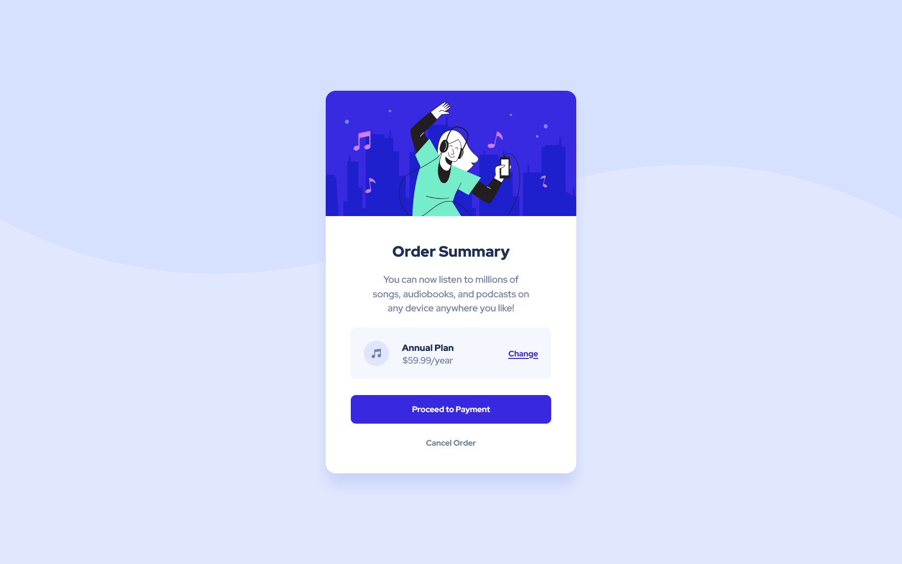
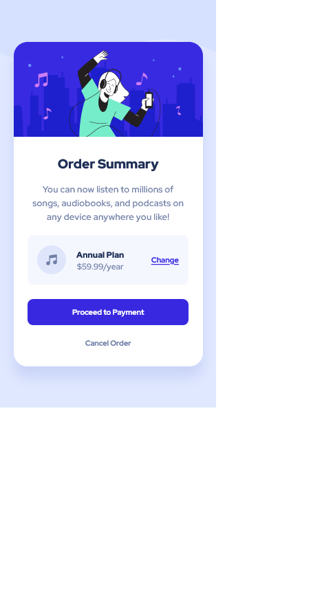

# Frontend Mentor - Order summary component solution 🚀


## Welcome 👋

This is a solution to the [Order summary challenge on Frontend Mentor](https://www.frontendmentor.io/challenges/order-summary-component-QlPmajDUj/). Frontend Mentor challenges help you improve your coding skills by building realistic projects.

## Table of contents 📑

- [Overview 🌟](#overview-🌟)
  - [The Challenge 🧪](#the-challenge-🧪)
  - [Screenshots 📷](#screenshots-📷)
  - [Links 🔗](#links-🔗)
- [My process 🏗️](#my-process-🏗️)
  - [Built with 🛠️](#built-with-🛠️)
  - [What I learned 🧠](#what-i-learned-🧠)
  - [Useful resources 📚](#useful-resources-📚)
- [Contact 📧](#contact-📧)
- [Author 👤](#author-👤)

## Overview 🌟

### The Challenge 🧪

Users should be able to:

- ✅ See hover states for interactive elements

### Screenshots 📷

_My solution (Desktop):_


_My solution (Mobile)_


### Links 🔗

- Solution repo on Github: [here](https://github.com/BeanyTheCoder/order-summary-component-main)
- Solution link on Front End Mentor: [here]()
- Live site link: [here](https://beanythecoder.github.io/order-summary-component-main)

## My process 🏗️

### Built with 🛠️

- HTML
- CSS(native nesting)

### What I learned 🧠

I tried out a bit of nesting in _native_ css

```css
button {
  padding: 10px 20px;
  background-color: red;
  color: white;
  border: none;
  border-radius: 5px;
  cursor: pointer;

  /* hover state done using css nesting */
  &:hover {
    background-color: blue;
  }
}
```

### Useful resources 📚

- Video on CSS Native Nesting: https://www.youtube.com/watch?v=YnWPeA6l5UE&t=408s&ab_channel=KevinPowell

- Online Color Picker(some colors in the design were not provided): https://imagecolorpicker.com/en
## Contact 📧

- Frontend Mentor - [@BeanyTheCoder](https://www.frontendmentor.io/profile/BeanyTheCoder)
- Github - [BeanyTheCoder](https://github.com/BeanyTheCoder)

## Author 👤

My name is Alexander Afoko Jnr. and I am a passionate 13-year-old frontend developer from Ghana.
I hope to build up my portfolio and take my skills to the next level.
